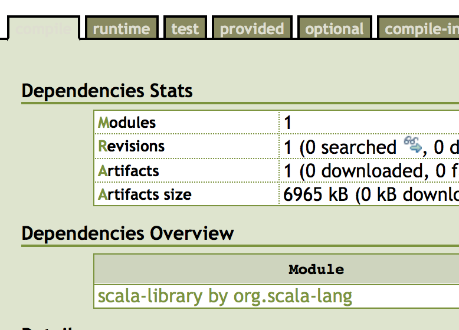
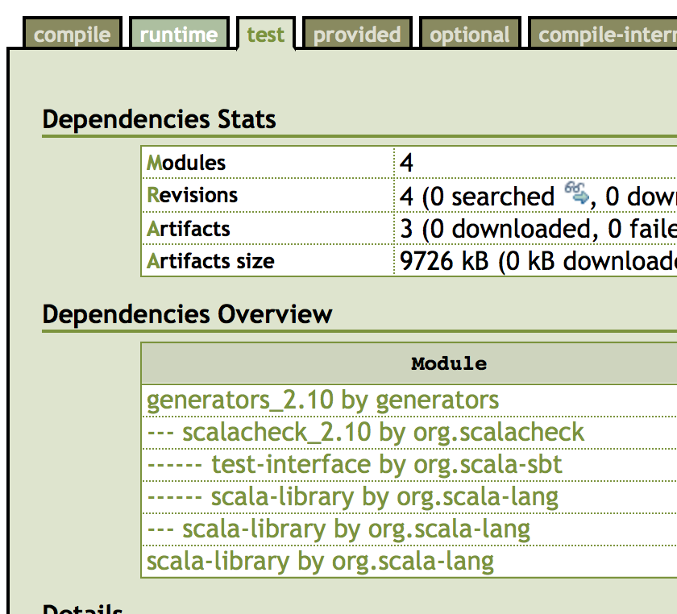

This project will publish a jar containiner the generators, then it will depend on those in the core module, only in the test scope. We can be sure that these never get added to the compilation phase simply by looking at the ivy report:

# compile

# test

